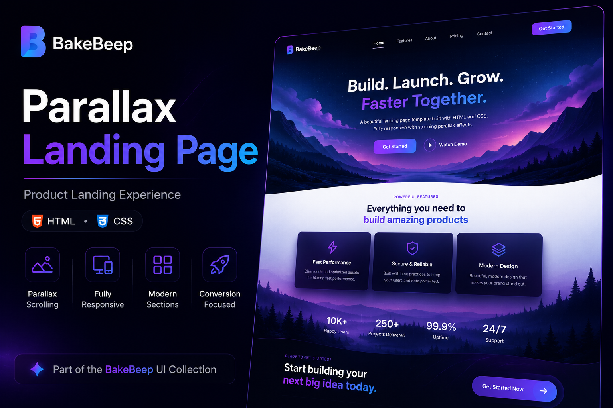
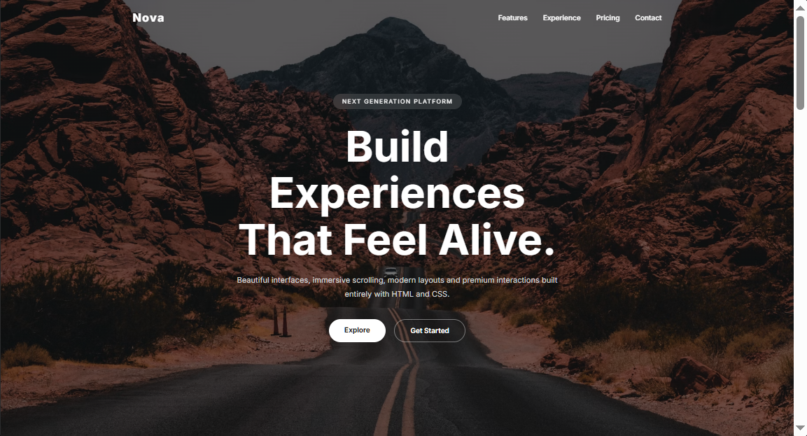
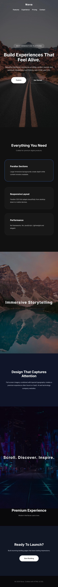

# Parallax Landing Page

> A modern product landing page built with HTML and CSS.




> **BakeBeep UI Collection**

This project is part of the **BakeBeep UI Collection**—a growing library of modern, reusable interface components and frontend patterns designed with performance, accessibility, and maintainability in mind.

---

## Overview

Parallax Landing Page demonstrates how immersive product experiences can be created using HTML and CSS. It combines full-screen hero sections, parallax scrolling effects, responsive feature layouts, and clear calls to action to emulate the style of modern SaaS and technology landing pages.

---

## Features

- Full-screen hero section
- Parallax scrolling backgrounds
- Responsive feature cards
- Call-to-action sections
- Smooth scrolling
- Modern typography
- Semantic HTML
- Mobile-friendly layout

---

## Demo

🌐 **Live Demo:** _Paste your Vercel deployment URL here_

### Animated Preview


### Desktop



### Mobile



---

## Design Philosophy

Great landing pages communicate value quickly. This project emphasizes hierarchy, readability, and visual depth while remaining lightweight and responsive.

---

## Technologies

- HTML5
- CSS3
- CSS Grid
- Flexbox
- CSS Gradients
- Media Queries
- `background-attachment: fixed`

---

## Folder Structure

```text
parallax-landing/
│
├── assets/
├── css/
├── index.html
├── LICENSE
└── README.md
```

---

## Future Improvements

- Interactive navigation
- Animated statistics
- Testimonial carousel
- Dark mode
- React implementation
- Tailwind CSS version
- CMS integration

---

## License

MIT License.

---

## About BakeBeep

BakeBeep is a software studio building modern web interfaces, reusable UI systems, and developer-focused digital products.

Every repository reflects our commitment to clean engineering, thoughtful design, accessibility, and continuous improvement.

Explore the BakeBeep UI Collection to discover more frontend projects.

